# 💶 EUR/PLN Tracker

<p align="center">
  <strong>Machine learning dashboard for fetching NBP exchange rates, training forecasting models and analyzing EUR/PLN predictions.</strong>
</p>

<p align="center">
  
  
  
  
  
  
</p>

<p align="center">
  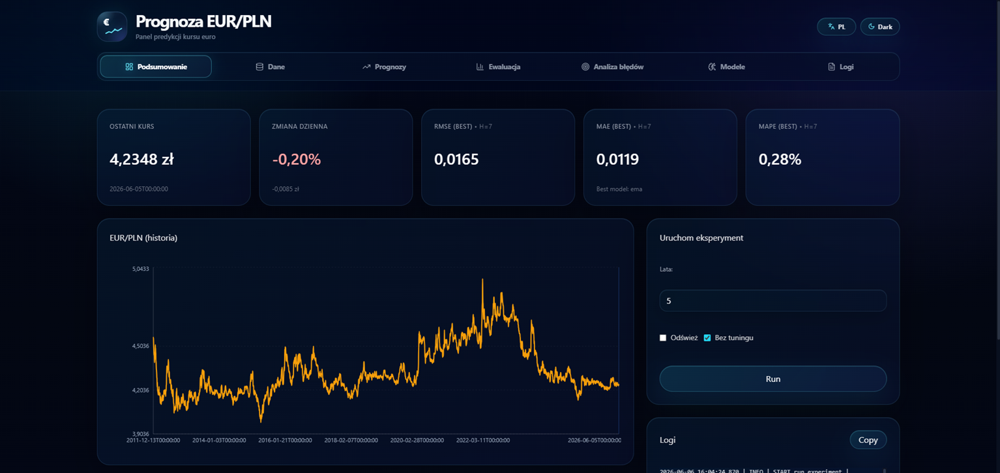
</p>

---

## 📚 Table of Contents

- [Overview](#overview)
- [Features](#features)
- [Machine Learning Pipeline](#machine-learning-pipeline)
- [Frontend Dashboard](#frontend-dashboard)
- [Screenshots](#screenshots)
- [Tech Stack](#tech-stack)
- [Requirements](#requirements)
- [Getting Started](#getting-started)
- [API Endpoints](#api-endpoints)
- [Project Structure](#project-structure)
- [Author](#author)

---

<a id="overview"></a>
## 📌 Overview

**EUR/PLN Tracker** is a forecasting dashboard for analyzing and predicting the EUR/PLN exchange rate.

The application fetches historical exchange rate data from the **NBP API**, builds time-series datasets, trains multiple forecasting models and presents the results in a React dashboard.

The main goal of the project is to create an end-to-end machine learning workflow:

- download exchange rate data,
- build datasets for different forecast horizons,
- train and compare several models,
- analyze prediction errors,
- display forecasts and metrics in a clean dashboard.

The project consists of two main parts:

- **Python backend** with FastAPI and ML pipeline,
- **React frontend** with a dark glassmorphism dashboard.

---

<a id="features"></a>
## ✨ Features

### 💱 NBP Data Fetching

- fetches EUR/PLN exchange rates from NBP
- stores raw historical data as CSV files
- supports incremental data updates
- handles unavailable newest NBP dates without breaking the whole pipeline
- keeps local data snapshots for repeatable experiments

### 🧠 Machine Learning Models

The pipeline supports multiple forecasting models:

- Naive baseline
- SMA
- EMA
- Ridge Regression
- ElasticNet
- Random Forest
- Extra Trees
- HistGradientBoosting
- SARIMAX
- MLPRegressor
- XGBoost
- LightGBM

Optional models can be enabled or disabled in the configuration.

### 📈 Forecast Horizons

The application supports multiple forecast horizons:

- H=1
- H=7
- H=30
- H=90
- H=180
- H=365

Each horizon can use a different lookback window and is evaluated separately.

### 📊 Metrics and Evaluation

The backend calculates metrics such as:

- MAE
- RMSE
- MAPE
- SMAPE
- bias
- direction accuracy

The frontend displays model performance and allows comparing true values with predicted values.

### 🔍 Error Analysis

The dashboard includes error analysis views with:

- residual chart
- prediction error preview
- top largest errors
- model-specific error comparison

### 🧾 Logs

The application displays backend pipeline logs directly in the frontend.

This helps track:

- data fetching,
- dataset building,
- model training,
- failed runs,
- successful runs.

### 🎨 Premium UI

The frontend includes:

- dark glassmorphism style
- iOS-like transparent cards
- custom logo
- premium tab navigation
- responsive dashboard layout
- interactive charts

---

<a id="machine-learning-pipeline"></a>
## 🧪 Machine Learning Pipeline

The backend pipeline is divided into several steps.

| Step | File | Description |
|---|---|---|
| Fetch data | `fetch_nbp.py` | downloads EUR/PLN rates from NBP |
| Build dataset | `build_dataset.py` | creates lag, rolling and calendar features |
| Train and evaluate | `train_eval.py` | trains models and saves predictions/metrics |
| Run full experiment | `run_experiment.py` | runs the complete pipeline |
| API | `api.py` | exposes results to the frontend |

### Dataset Features

The generated datasets include:

- lag features,
- rolling averages,
- rolling standard deviations,
- EMA values,
- daily difference,
- log return,
- day of week,
- month,
- target date calendar features.

### Output Artifacts

Each successful run can generate files such as:

```text
metrics.json
metrics.csv
forecast_points.csv
predictions_H1.csv
predictions_H7.csv
predictions_H30.csv
predictions_H90.csv
predictions_H180.csv
predictions_H365.csv
backtest.json
best_ml_params.json
summary.json
pipeline_status.json
pipeline.log
```

The API reads the newest successful run with generated artifacts.

---

<a id="frontend-dashboard"></a>
## 🖥️ Frontend Dashboard

The frontend is divided into several tabs.

| Tab | Description |
|---|---|
| Podsumowanie | main dashboard with latest exchange rate, daily change, metrics and historical chart |
| Dane | historical EUR/PLN data table and latest records |
| Prognozy | forecasts for selected horizons and models |
| Ewaluacja | true vs predicted values and test metrics |
| Analiza błędów | residuals, error distribution and largest prediction errors |
| Modele | model configuration, available models and selected best model |
| Logi | backend logs from pipeline runs |

---

<a id="screenshots"></a>
## 🖼️ Screenshots

### Summary

| Dark mode | Light mode |
|---|---|
| 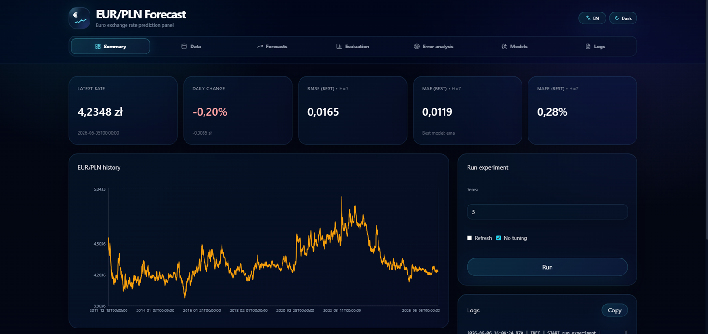 | 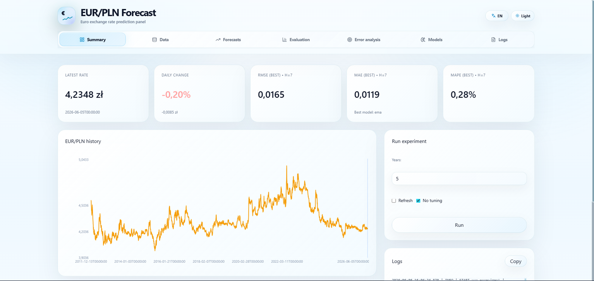 |

### Data

| Data overview | Recent records |
|---|---|
| 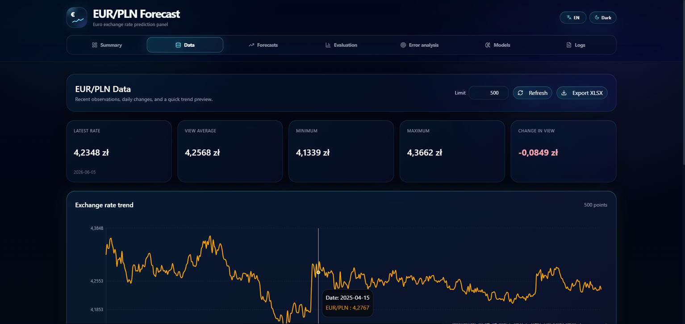 | 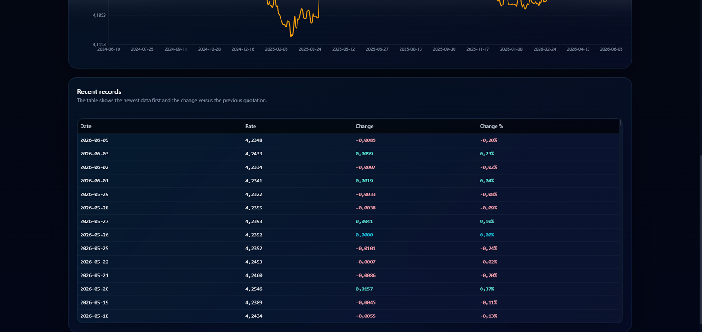 |

| Light mode |
|---|
| 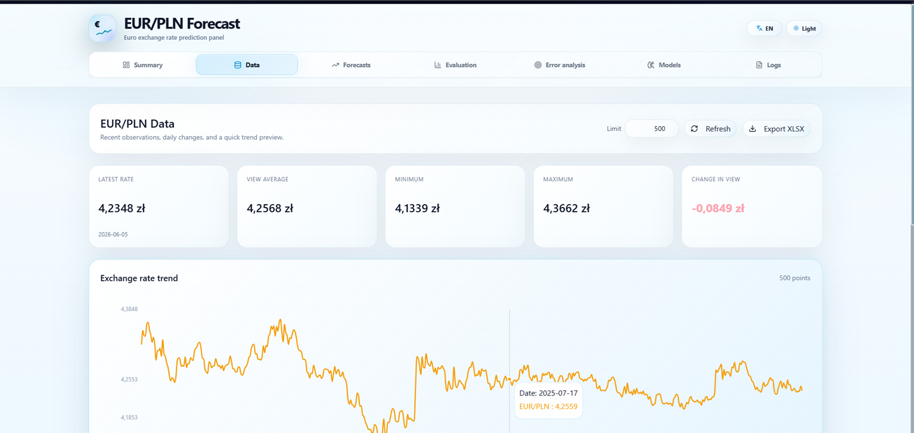 |

### Forecasts

| Dark mode | Light mode |
|---|---|
| 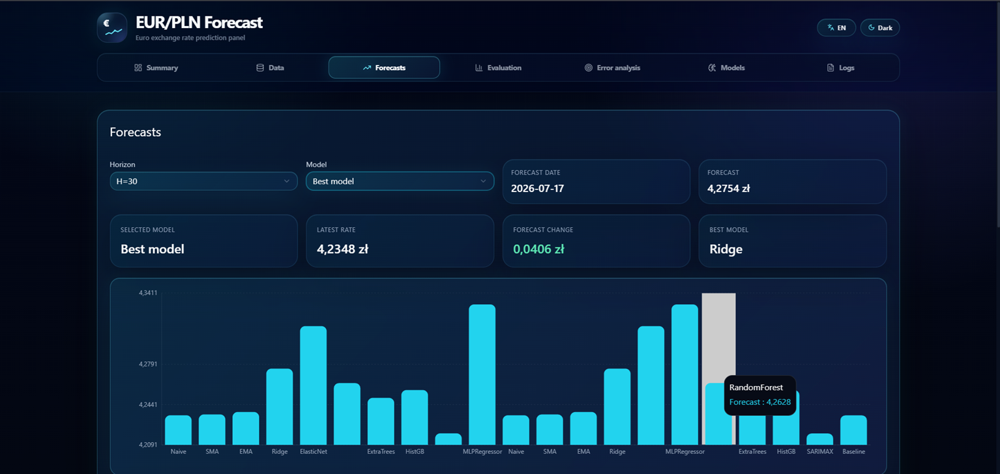 | 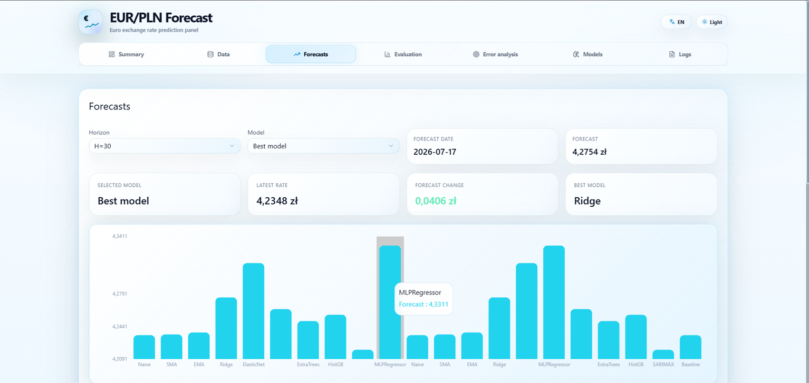 |

### Evaluation

| Evaluation chart | Prediction scatter |
|---|---|
| 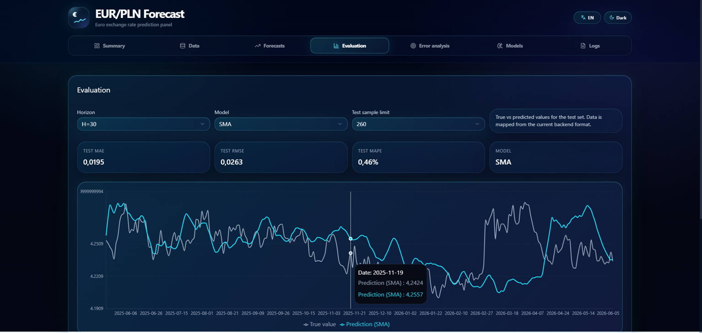 | 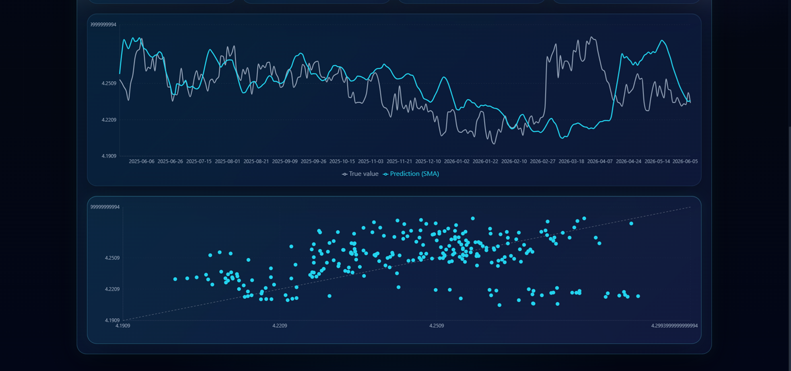 |

### Error analysis

| Error analysis |
|---|
| 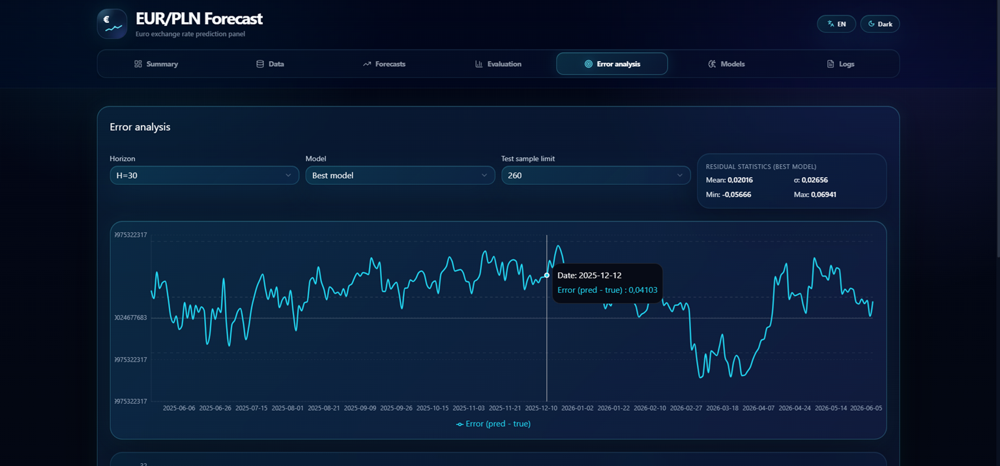 |

### Models

| Dark mode | Light mode |
|---|---|
| 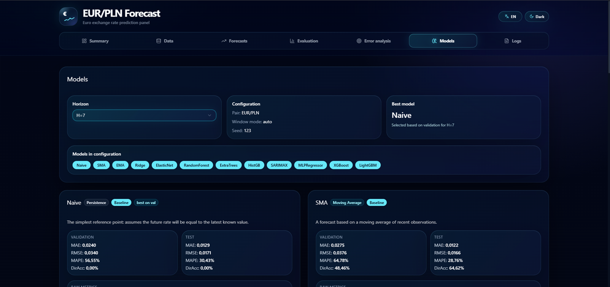 | 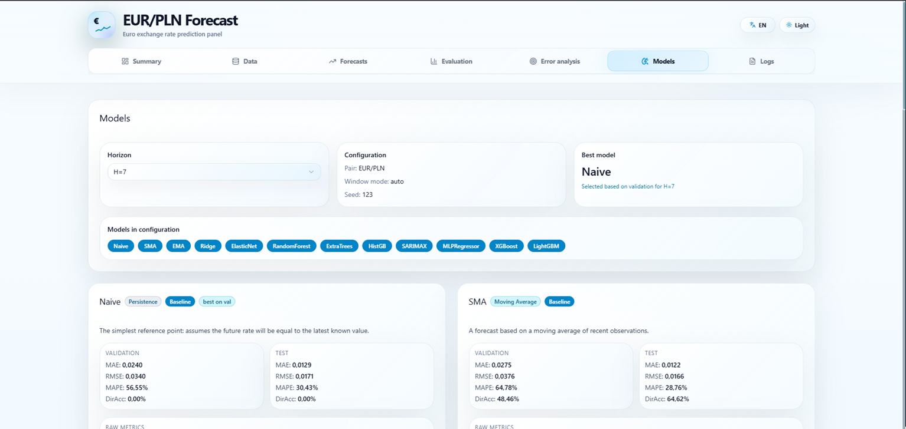 |

### Logs

| Logs |
|---|
| 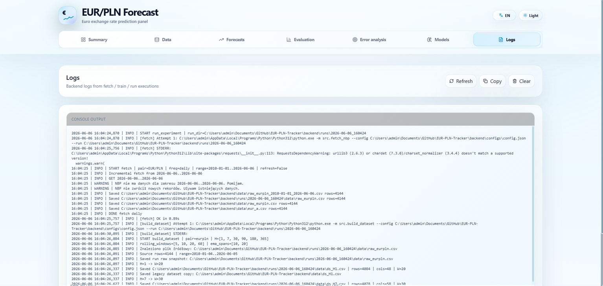 |

---

<a id="tech-stack"></a>
## 🛠️ Tech Stack

| Area | Technology |
|---|---|
| Backend | Python |
| API | FastAPI |
| Data processing | pandas, NumPy |
| Machine learning | scikit-learn |
| Time series model | SARIMAX |
| Optional ML models | XGBoost, LightGBM |
| Frontend | React |
| Frontend language | TypeScript |
| Build tool | Vite |
| Charts | Recharts |
| Icons | Lucide React |
| Styling | CSS, Tailwind, dark glassmorphism |
| Data source | NBP API |
| Deployment | GitHub Pages frontend + separate FastAPI backend |

---


<a id="requirements"></a>
## ⚙️ Requirements

To run the project locally, you need:

- Python 3.10 or newer
- Node.js 18 or newer
- npm
- Git
- modern web browser

Recommended:

- Visual Studio Code
- PowerShell or Windows Terminal

---

<a id="getting-started"></a>
## 🚀 Getting Started

### 1. Clone the repository

```bash
git clone https://github.com/Avuii/EUR-PLN-Tracker.git
cd EUR-PLN-Tracker
```

### 2. Install backend dependencies

```bash
cd backend
py -m pip install -r requirements.txt
```

### 3. Run the ML pipeline

For a faster local run without hyperparameter tuning:

```bash
py -m src.run_experiment --config configs/config.json --no-tuning
```

For the full experiment:

```bash
py -m src.run_experiment --config configs/config.json
```

The generated results will be saved in:

```text
backend/runs/
```

### 4. Run the backend API

```bash
py -m uvicorn api.api:app --reload --host 127.0.0.1 --port 8000
```

The backend should be available at:

```text
http://127.0.0.1:8000
```

Health check:

```text
http://127.0.0.1:8000/api/health
```

### 5. Run the frontend

Open a second terminal:

```bash
cd frontend
npm install
npm run dev
```

The frontend should be available at:

```text
http://127.0.0.1:4200
```


---

<a id="api-endpoints"></a>

## 🔌 API Endpoints

| Endpoint | Description |
|---|---|
| `GET /api/health` | backend health check |
| `GET /api/results` | main dashboard results |
| `GET /api/series?days=3650` | historical EUR/PLN series |
| `GET /api/data?limit=500` | historical data table |
| `GET /api/predictions?h=30` | predictions for selected horizon |
| `GET /api/forecast?h=30` | forecast point for selected horizon |
| `GET /api/logs` | latest pipeline logs |
| `GET /api/runs` | list of pipeline runs |
| `POST /api/run` | run pipeline from frontend |
| `GET /api/export/data.xlsx` | export historical data to XLSX |

---

<a id="project-structure"></a>

## 📁 Project Structure
```
EUR-PLN-Tracker/
├── backend/
│   ├── api/
│   │   ├── __init__.py
│   │   └── api.py
│   ├── configs/
│   │   └── config.json
│   ├── data/
│   │   ├── raw_eurpln.csv
│   │   ├── eur_a.csv
│   │   ├── ds_H1.csv
│   │   ├── ds_H7.csv
│   │   ├── ds_H30.csv
│   │   ├── ds_H90.csv
│   │   ├── ds_H180.csv
│   │   └── ds_H365.csv
│   ├── runs/
│   │   └── YYYY-MM-DD_HHMMSS/
│   │       ├── config.json
│   │       ├── pipeline.log
│   │       ├── pipeline_status.json
│   │       ├── metrics.json
│   │       ├── metrics.csv
│   │       ├── forecast_points.csv
│   │       ├── predictions_H30.csv
│   │       ├── backtest.json
│   │       └── summary.json
│   ├── src/
│   │   ├── build_dataset.py
│   │   ├── config.py
│   │   ├── fetch_nbp.py
│   │   ├── run_experiment.py
│   │   └── train_eval.py
│   └── requirements.txt
│
├── frontend/
│   ├── public/
│   ├── src/
│   │   ├── app/
│   │   │   ├── components/
│   │   │   │   ├── ChartsTab.tsx
│   │   │   │   ├── DashboardTab.tsx
│   │   │   │   ├── DataTab.tsx
│   │   │   │   ├── ForecastTab.tsx
│   │   │   │   ├── LogsTab.tsx
│   │   │   │   ├── ModelErrorsTab.tsx
│   │   │   │   └── ModelsTab.tsx
│   │   │   ├── lib/
│   │   │   └── App.tsx
│   │   ├── styles/
│   │   │   └── theme.css
│   │   ├── main.tsx
│   │   └── index.css
│   ├── package.json
│   └── vite.config.ts
│
├── screenshots/
│   ├── Podsumowanie.png
│   ├── dane.png
│   ├── dane_ostatnierekordy.png
│   ├── ewaluacja.png
│   ├── analizabledow.png
│   ├── analizabledow2.png
│   ├── modele.png
│   ├── modele1.png
│   ├── logi.png
│   └── logi2.png
│
├── .gitignore
└── README.md
```

---

<a id="author"></a>

## 👩‍💻 Author

Created by Katarzyna Stańczyk.
